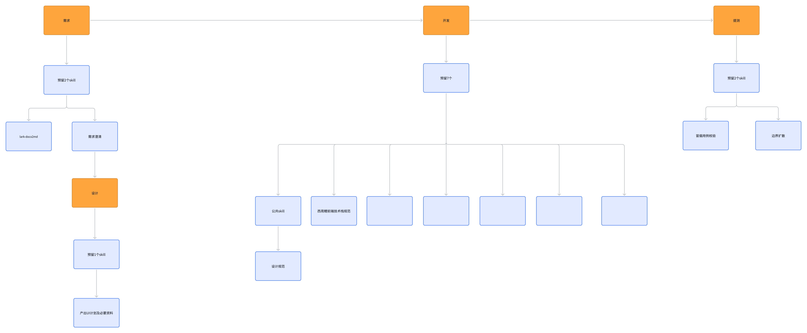

# AI Coding 的 Skills 场景与数量规划

项目中的 Skill 随实践增加后，需要同时管理职责、触发条件、参考材料和维护成本。本规划按需求、设计、开发、提测组织加载入口，检查数量增长是否带来职责重叠、误触发或无关上下文。

这是当前业务项目的结构规划。预留数量用于讨论和验证，不能作为行业最优数量，也不能单凭数量推定模型效果。整体背景见[AI Coding 跃迁总览](../../../frontend-leadership/tech-efficiency-architect/references/ai-coding-evolution.md)。

## 场景结构



[查看结构原图](../assets/ai-coding-skills-structure.png)

| 场景 | 预留位置 | 已明确内容 | 主要输出 |
| --- | ---: | --- | --- |
| 需求 | 2 | lark-docx2md、需求澄清 | 可引用的需求材料、待确认项与已确认边界 |
| 设计 | 1 | 名称待定，承担 UI 计划与资料整理 | UI 计划、页面状态及实现所需资料 |
| 开发 | 7 | 公共 Skill、前端技术栈规范，其余 5 项待定 | 按项目约定实现任务，并保留判断与验证记录 |
| 提测 | 2 | 冒烟用例校验、边界扩散 | 冒烟执行记录、异常与回归检查项 |

当前合计预留 12 个位置。需求澄清向设计传递已确认的任务背景，设计材料进入开发；提测继续使用需求、设计、接口和实现中的验收约定。阶段间复用材料，不重复复制规则。

图中“公共 Skill”关联“设计规范”。这里将设计规范作为公共入口引用的资料，不额外计入 12 个位置。设计阶段的 1 个入口负责本次 UI 计划，与公共设计规范的维护职责不同。

## 每个入口需要说明什么

以下输入、输出与边界用于把结构图落实为可检查的职责；尚未命名的入口保留待定，待项目实践后细化。

| 入口 | 输入 | 输出与责任边界 |
| --- | --- | --- |
| lark-docx2md | 经授权的需求文档、图片与来源信息 | 整理可读取材料并保留来源；不代替业务确认 |
| 需求澄清 | 需求、上下文、已知约束 | 歧义、异常条件、验收缺口与确认结果；未知内容不能补成事实 |
| 设计阶段入口（待命名） | 已确认需求、设计资料与公共规范 | UI 计划及必要材料；与设计和开发确认状态、组件与交互约束 |
| 公共 Skill | 当前任务类型与共享规范索引 | 路由到必要的公共材料；不一次加载所有参考文档 |
| 前端技术栈规范 | 目标项目、技术栈版本与实现任务 | 应用项目约定并指出冲突；不维护需求事实或复制设计规范 |
| 开发其余 5 项（待定） | 待真实重复场景明确 | 暂不创建空壳 Skill，不推定为已落地能力 |
| 冒烟用例校验 | 已确认关键路径、测试环境与执行方式 | 检查适用用例并记录实际执行结果；未运行不能记为通过 |
| 边界扩散 | 需求边界、变更影响面、接口和历史问题 | 补充异常路径与回归候选；由人员确认范围并安排验证 |

## 目录归属与任务加载

目录用于明确资产归谁维护，场景用于决定本次读取什么。两者可以同时成立，不需要为需求、设计、开发、提测各复制一份相同规则。

本仓库仍采用两级 Skill 目录：

```text
.agents/skills/<归属目录>/<技能目录>/
├── SKILL.md       # 职责、触发条件、处理步骤与资料入口
├── references/    # 按需读取的规范、案例与详细说明
├── templates/     # 可复用模板
└── assets/        # 图示、表单及其他静态材料
```

这是资产布局示意，不要求每个 Skill 都创建全部子目录。业务项目落地时还需验证目标 Agent 的发现与加载方式；规划中的 Skill 名称不代表本仓库已经安装或实现对应工具。

每次任务先识别阶段与问题，再选择能覆盖任务的必要入口。读取 SKILL.md 后，只加载当前步骤引用的资料。出现跨阶段任务时可以组合多个 Skill，但需说明各自负责什么，共用同一份已确认事实。

发现规则冲突时，按目标项目已有的指令优先级和授权处理；不能按文件加载先后随意覆盖，也不能将单次对话中的偏好直接变成全项目规则。

## 如何做数量上的加法与减法

新增入口前，需要有重复出现的任务、清楚的触发条件，以及现有入口无法合理承接的职责。仅仅多了一份文档或一种输出格式，通常先作为已有 Skill 的参考材料或模板维护。

如果多个 Skill 总是一起触发、重复维护相同规则，应检查是否合并或提取共享引用。如果单个入口同时承担不相关任务，导致选择与验证困难，再考虑拆分。

失效、重复或长期无法证明用途的入口应移除或归档，同时修正索引与引用。图中的预留数量可以随记录调整，不能为了达到 2/1/7/2 而增加无用资产。

## 需要留下的验证记录

| 记录项 | 需要回答的问题 |
| --- | --- |
| 场景与任务 | 当前处于哪个阶段，真正需要完成什么 |
| 选用入口 | 加载了哪些 Skill，选择理由是什么 |
| 读取资料 | 哪些参考材料被使用，是否存在重复或过期内容 |
| 执行偏差 | 是否误触发、漏触发、出现冲突或需要额外纠正 |
| 结果与投入 | 输出能否验收，审查、返工、耗时及维护成本如何 |
| 调整决定 | 保留、合并、拆分或移除什么，下一次如何复核 |

先用可比任务观察调整前后的行为和结果，再判断结构是否改善。数量是可调整的设计参数，任务正确完成和维护成本才是取舍依据。
