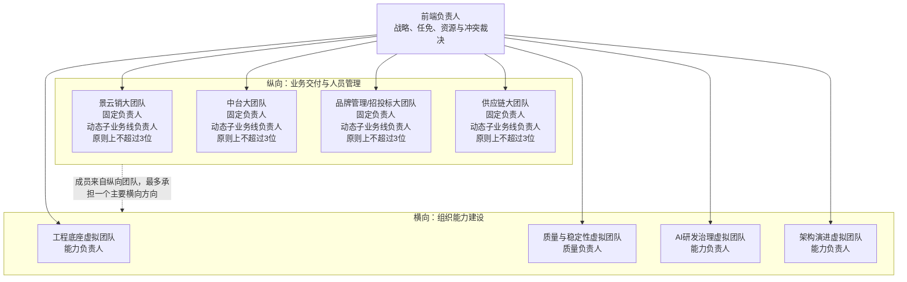

# 前端负责人管理业务线的方法

## 核心定位

这不是“业务线负责人经验分享”，而是前端负责人管理业务线的方法、方案和体系。

可用表述：

> 前端负责人管理业务线，需要的是方案、边界、节奏和责任，不是单点经验。

## 组织前提

业务线负责人机制能落地，前提是管理层支持前端负责人进行分层管理和授权实践。前端负责人不是单纯把任务分出去，而是在授权空间内定义负责人边界、风险上浮规则、评审机制和复盘机制。

可用表述：

> 在管理层支持与授权下，业务线负责人机制才能从临时分工变成稳定管理结构；前端负责人要做的是把授权转化为清晰边界、固定节奏和结果责任。

## 业务线负责人角色

业务线负责人不是传话人，而是业务线第一责任人。前端负责人负责设计管理方式、授权边界、评审机制、复盘机制和风险兜底。

## 人员可用性变化责任链

请假、临时离岗等人员可用性变化，不应只由前端负责人知晓后再转告业务线负责人。谁先获得信息、谁做第一次影响判断、谁协调资源，谁才是团队实际运行中的负责人。

- 成员先同步所属业务线负责人，说明时间范围、在途事项、里程碑影响和交接安排。
- 业务线负责人负责判断交付影响，安排交接、替补或排期调整；业务线内无法消化时及时上浮。
- 前端负责人处理跨业务线资源协调、重大里程碑风险和组织流程审批，不代替业务线负责人完成第一次业务判断。
- 如果组织系统仍由前端负责人最终审批，应先由业务线负责人完成业务影响确认，再进入最终审批。
- 成员越过业务线负责人直接同步时，前端负责人应引导其补齐业务确认，不直接代为闭环。
- 业务确认用于完成交付安排，不应以业务压力否定正常请假；病假或紧急情况可以先处理，事后及时补充同步。

可用表述：

> 人员可用性变化的知情权、判断权、调度权和交付责任应同步下放；业务线负责人对已经知情、能够协调，但没有处理或上浮的交付阻塞负责。

## 管理对象

- 当前28人前端团队，预计约30人。
- 4个稳定大团队：景云销、中台、品牌管理/招投标、供应链。
- 4位固定大团队负责人。
- 业务线内需求模块副手已就位。

## 多子业务线扩展模型

后续新增项目或新业务线，不默认新增平级的大团队，也不以临时项目战队作为主要组织结构。组织的稳定单元仍是现有大团队，新业务优先在组内分配，并按业务成熟度动态设置子业务线负责人。

- 大团队负责人保持稳定，负责多个子业务线的项目组合、优先级、资源调度、质量标准和负责人培养。
- 子业务线负责人从副手和梯队人选中产生，负责具体业务线的需求承接、方案评审、交付节奏、风险预警和复盘。
- 成员长期归属大团队，可以随组内业务优先级调整，不因单个项目启动或结项频繁改变组织归属。
- 新业务初期可以先明确具体负责人，不急于形成完整管理层；业务持续稳定后，再将负责人升级为子业务线负责人。
- 只有业务边界长期独立、团队规模持续扩大、跨业务协作成本明显上升且已有成熟负责人时，才评估拆分新的平级大团队。

可用表述：

> 理想状态不是业务增加多少就新增多少团队，而是保持现有大团队和负责人稳定，让一个大团队能够承接多个相关业务线，再通过子业务线负责人动态扩展管理半径。

## 纵横管理矩阵

矩阵运行边界：

- 纵向大团队是成员唯一的组织归属，负责业务、人员、排期、交付和本线质量结果。
- 横向虚拟团队负责跨业务线的机制、标准、资产和能力结果，不直接改变成员的业务优先级。
- 每个横向虚拟团队设置一位明确负责人，直接向前端负责人汇报方向进展、结果和资源风险。
- 成员原则上最多承担一个主要横向方向，避免多个虚拟团队同时占用同一批骨干。
- 4个横向方向可以长期存在，但每季度最多2个进入重点建设状态，其他方向只保留负责人、问题池和必要维护。
- 纵横矩阵交叉格只记录真实存在的接口人、建设事项和结果状态，不要求16个交叉格全部配置成员。
- 纵向交付与横向建设发生冲突时，先由双方负责人协商，无法解决时由前端负责人裁决。

完整的负责人数量约束、子业务线任命门槛、横向最低产能、季度结果、管理节奏、冲突处理和退出机制，见 [30人前端团队可经营组织运行系统](organization-operating-system.md)。

## 质量与稳定性虚拟团队

质量与稳定性虚拟团队设置一位明确的质量负责人，从相关大团队选择质量接口人和工程骨干参与，不由4位固定大团队负责人共同组成。大团队负责人仍对本线质量结果负责，并为整改事项提供必要资源，但不作为质量虚拟团队的固定治理核心。

- 质量负责人对跨业务线的缺陷地图、治理计划、推进节奏、结果指标和复发验证负责。
- 每位大团队负责人对本业务线的缺陷发现、整改资源和最终结果负责，但不承担横向团队的日常统筹。
- 跨业务线共性问题由质量负责人组织识别，每个具体事项必须指定一位执行负责人。
- 质量投入采用“季度最低结果承诺 + 日常动态调配”，不能因为重要但不紧急而长期没有结果。
- 质量团队负责发现问题、判断根因、推动整改和验证复发情况，不替业务线或工程底座包办所有实现工作。
- 前端负责人作为发起人和资源仲裁者，负责质量优先级、跨线资源和重大风险，不收回日常执行。

## 机制演进

- 第一年末已经做了业务线负责人考察和机制完善。
- 最近3个月重点系统化跟进负责人SOP实践效果。
- 机制当前有效，但仍在持续反馈、持续完善，目标是可持续正向迭代。

## 已落地抓手

- 周会授权业务线负责人把控。
- 月度复盘不固定但已存在，用于统一信息、确保方向一致，同时减少会议消耗。
- 前端负责人不定期做1对1。
- 推动业务线负责人做团队1对1沟通。
- 技术方案评审已在进行，并输出对应SOP。
- AI阶段更重视代码评审，要求负责人做好评审并确保人为代码负责。
- 需求模块副手已经开始主动承担，关键模块具备承接能力。

## 副手建设口径

不要用 Backup。统一用“副手”“需求模块副手”“梯队人选”。

可用表述：

> 业务线内需求模块副手已开始主动承担，关键模块具备承接能力，避免项目只依赖单点负责人，保障需求持续推进、问题有人响应、关键模块有人兜底。

## 管理挑战

30人以后，真正风险不是人不够，而是：

- 标准稀释。
- 知识断层。
- 协作成本上升。
- 单点依赖。
- AI提效后责任边界不清。

## 未来目标

短期：稳住30人团队。

- 完成后续2人补充。
- 持续校准4位固定大团队负责人稳定性。
- 完善副手与梯队建设。

中期：新增业务线在现有大团队内按SOP快速接入。

- 业务归属与大团队确认。
- 子业务线负责人识别与任命。
- 需求接入。
- 技术方案评审。
- 代码评审。
- 测试验收。
- 上线复盘。
- 风险预警。

长期：形成可复制的前端组织能力。

- 新业务线不再依赖临时协调，也不默认新增平级团队。
- 大团队负责人、子业务线负责人、工程底座和AI开发闭环可以在现有团队内持续复制。
- 支撑后续子公司前端接入。
