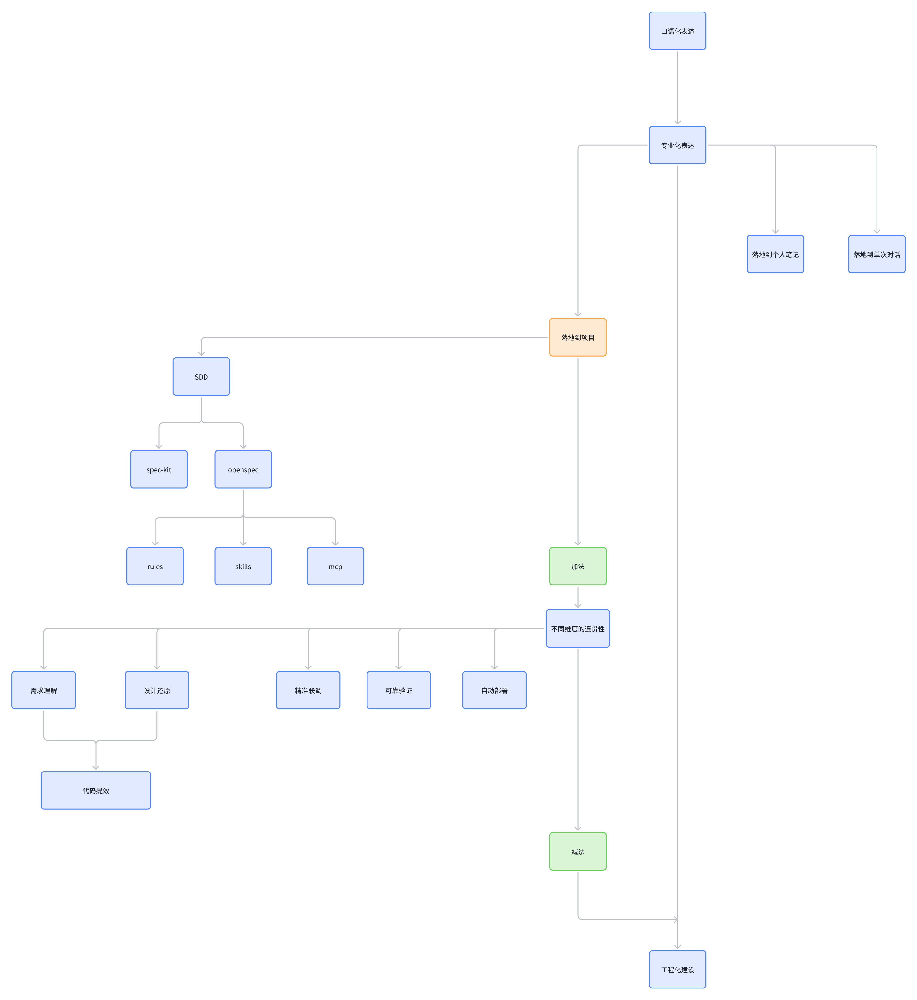
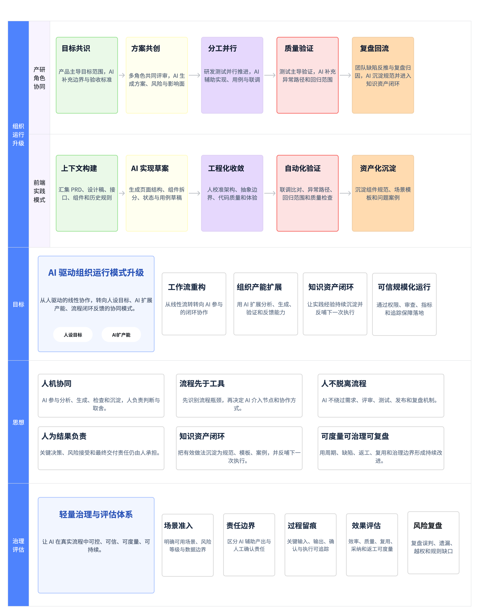

# AI Coding 跃迁：从个人实践到工程化建设

AI Coding 的推进从表达方式开始：把目标、约束和验收条件说明白，再将这些信息放进真实项目。随着需求、设计、接口和测试逐步接入，需要继续处理流程衔接、人员责任和知识维护，才能让一次有效的尝试变成可重复的工作方式。

这份构思与实践文档按四张图展开：AI 递进节奏、产研组织升级、AI 实践架构、Skills 结构规划。图中的流程和数量用于说明当前方案；是否落地、是否有效，需要在具体项目中记录和验证。

| 阅读顺序 | 解决的问题 | 详细说明 |
| --- | --- | --- |
| [AI 递进节奏图](#一ai-递进节奏图) | 从表达、项目接入到工程化，先补什么，再收敛什么 | 本文第一节 |
| [AI 驱动产研组织升级](#二ai-驱动产研组织升级构思-实践版) | AI 如何进入角色协同、流程和治理 | [组织协作设计](ai-driven-product-rd-organization-upgrade.md) |
| [AI 实践架构图](#三ai-实践架构图) | 以当前前端团队的定位，怎样组织输入、工具和执行过程 | [实践架构与 Harness](ai-product-rd-collaboration-architecture.md) |
| [Skills 结构规划图](#四skills-结构规划图) | 不同场景加载哪些 Skill，怎样控制数量与重叠 | [Skills 场景与数量规划](../../../company-public/skill-governance/references/ai-coding-skills-planning.md) |

## 一、AI 递进节奏图

[查看递进节奏原图](../assets/ai-coding-progression.png)

### 从口语化表达走向专业化表达

最初可以用自然语言描述想法。进入具体任务后，需要补齐业务对象、输入材料、约束、边界和验收条件，让后续讨论有共同依据。专业化表达的重点是减少歧义，让判断和结果可核对。

整理后的内容有不同去向：一次性问题可以留在单次对话，个人观察可以进入笔记，需要协作执行和持续维护的内容才进入项目。并非每次对话都需要生成一套规则或 Skill。

### 项目内先做加法，补齐衔接

项目中的“加法”是补齐任务所需的材料、流程和工具。SDD 可以帮助组织需求、方案和验收，spec-kit、OpenSpec 是图中列出的可选路径；rules、Skills、MCP 等能力则按项目需要配合使用。

这些节点表达的是方案组合关系，不表示它们必然是某个工具的内置模块。图中从 OpenSpec 延伸到 rules、Skills、MCP，体现的是当前实践中的组合思路。

需要连接的工作包括：

| 工作 | 需要保持连续的信息 | 应核对的结果 |
| --- | --- | --- |
| 需求理解 | 业务目标、范围、异常条件与验收口径 | 未确认的问题没有被直接当成实现依据 |
| 设计还原 | 设计稿、组件约束、交互状态和需求规则 | 页面外观与实际行为均满足要求 |
| 精准联调 | 接口契约、版本、模拟数据和异常响应 | 实现与真实接口一致，变更能够同步 |
| 可靠验证 | 用例、测试执行、代码审查与回归范围 | 有执行结果，问题能追溯到具体变更 |
| 自动部署 | 发布条件、环境、权限、监控和回滚安排 | 满足项目发布要求，失败有恢复方式 |

需求理解和设计还原共同支撑代码提效；联调、验证和部署继续检验生成的实现是否可交付。自动部署属于工程能力建设方向，仍遵守项目的审批与发布要求。

### 再做减法，收束到工程化建设

当材料和工具逐渐增加，需要反过来检查：哪些规则重复，哪些 Skill 总是一起触发，哪些资料已经过期，哪些步骤只有增加成本却没有改善结果。

“减法”包括合并重复入口、按场景加载、移除失效材料，以及把稳定规则放到更合适的位置。它与前面的加法相互配合，不能用减少数量代替效果判断。

第一张图的终点是工程化建设：有效材料有稳定入口，任务有可执行步骤，关键结论有人确认，结果经过验证，经验有维护和回流方式。专业化表达也可以直接推动这些建设，不必为了走完图上的每个节点而增加工具。

## 二、AI 驱动产研组织升级（构思-实践版）

从个人工具提效，走向 AI 嵌入角色协同、流程闭环与治理评估。

[查看组织升级原图](../assets/ai-product-rd-collaboration-overview.png)

### 组织运行升级

产研角色协同按“目标共识 → 方案共创 → 分工并行 → 质量验证 → 复盘回流”推进。产品主导目标范围，多角色共同评审，研发与测试基于已确认的约定开展工作，再将验证和复盘中的结论带回后续任务。

前端实践按“上下文构建 → AI 实现草案 → 工程化收敛 → 自动化验证 → 资产化沉淀”展开。开发人员校准架构、抽象边界、代码和体验，实际执行测试联调，再维护有效的组件规范、模板与案例。两条流程相互配合，不要求每一步严格一一对应。

### 目标

图中的四项目标是工作流重构、组织产能扩展、知识资产闭环和可信规模化运行。需要观察的分别是交接与等待是否改善、总投入是否合理、经验是否在新任务中起效，以及权限和维护机制能否随采用范围扩大继续运行。

### 思想

人机协同、流程先于工具、人不脱离流程、人为结果负责，是参与方式与责任的基本约束。知识资产闭环，以及可度量、可治理、可复盘，要求团队把有效做法和失败记录转化为可维护资料，用实际结果决定后续调整。

### 治理评估

场景准入确定可用范围与风险；责任边界确定谁确认产出；过程留痕保留输入、判断与执行记录；效果评估同时观察效率、质量、复用和返工；风险复盘追踪误判、遗漏、越权及规则缺口。

具体角色分工和验收依据见[组织协作设计](ai-driven-product-rd-organization-upgrade.md)。前端可以先在职责范围内验证，跨角色调整和更大范围推广需要相应授权与资源。

## 三、AI 实践架构图

围绕当前前端团队在产研中的定位，梳理需要实践的 AI 能力，以及可以持续迭代的 Harness 工程方案。

[查看实践架构原图](../assets/ai-practice-harness-architecture.png)

### 从协作材料到任务上下文

产品侧提供需求文档，前端通过 lark-docx2md 与图片整理材料；UI 侧通过 MCP 与 Skill 衔接设计信息；后端侧关联 Apifox 接口资料；测试侧关联冒烟用例与禅道中的问题记录。

这些内容需要关联到同一项任务，并核对版本、权限和未确认事项。连接工具只是获取信息的一步，材料的有效性和业务含义仍由对应角色确认。

### Harness 承担什么

本文中的 Harness 指围绕模型执行任务的工程环境：准备上下文，组织步骤与工具，设置检查点，保留反馈并支持下次执行。

图中列出 OpenSpec、Agent.md、memory、MCP、Skills、RAG 和 context，并由 Agent.md 关联 rules。它们分别处理流程、项目约定、已确认经验、工具连接、可复用方法、资料检索和本次任务材料。图中的 Agent.md 表示项目级指导入口，本仓库对应文件为 AGENTS.md。

### V1.0 与 V2.0 的递进

V1.0 展示 proposal、apply、validate、archive 的主流程，同时安排配置确认、需求澄清、审查、重新读取需求、经验记录、自测和冒烟等动作。

V2.0 将需求、业务规格、设计决策和任务进一步拆开，在实现前增加逐步人工审查；新开会话时重新读取需求，完成实现和规格验证后继续代码审查、自测与冒烟。冒烟不通过则修复并重新检查，通过后归档；有效经验进入 memory。

这里的 V1.0/V2.0 是实践方案的迭代标记。图中的 OpenSpec 节点与主动动作需要共同工作，规格验证也不能代替运行测试。具体步骤、恢复执行方式和版本边界见[实践架构与 Harness](ai-product-rd-collaboration-architecture.md)。

## 四、Skills 结构规划图

随着项目中的 Skill 增多，职责重叠、误触发和无关上下文可能增加执行成本。这一版按需求、设计、开发和提测分别规划入口与数量，再通过任务记录判断是否需要合并、拆分或移除。

[查看 Skills 结构原图](../../../company-public/skill-governance/assets/ai-coding-skills-structure.png)

| 场景 | 预留数量 | 当前明确的内容 |
| --- | ---: | --- |
| 需求 | 2 | lark-docx2md、需求澄清 |
| 设计 | 1 | 产出 UI 计划及必要资料；独立名称待定 |
| 开发 | 7 | 公共 Skill、前端技术栈规范；其余 5 个位置待定 |
| 提测 | 2 | 冒烟用例校验、边界扩散 |

共预留 12 个位置，是当前业务项目的容量规划，不表示已有 12 个实现，也不要求一次任务加载全部内容。图中公共 Skill 下的设计规范先作为其关联材料，不额外计为一个 Skill；具体资产形态仍可随验证调整。

“边界扩散”用于从需求与变更影响面补充异常路径和回归候选，实际测试范围仍由人员确认。开发中的空白位置按真实重复需求补齐，不能为凑满数量提前添加职责。

物理目录按资产归属保持稳定，执行时按任务阶段选择必要入口，正文与参考材料逐步加载。各入口的输入、输出、边界和数量调整方式见[Skills 场景与数量规划](../../../company-public/skill-governance/references/ai-coding-skills-planning.md)。

## 实践记录与后续验证

基于这份文档，已在公司内部开展一次“AI 驱动组织运行模式升级讨论”主题分享，围绕协作分工、前端样板、责任边界及三个候选试点展开。完整内容见[内部分享稿](ai-organization-operating-model-sharing.md)。目前记录到的实践动作是分享与讨论；试点是否启动、产生何种效果，需另行记录。

四张图分别描述推进节奏、组织协作、执行环境和技能组织方式。实际落地时，应记录采用了哪部分方案、谁负责、在哪类任务中运行，以及还存在哪些问题。

先验证材料能否正确进入任务、人员确认是否有效，再观察实现、联调、测试和复盘能否连续运行。最后结合任务总投入、缺陷、返工、维护成本和 Skill 误触发情况，决定哪些做法保留、哪些需要调整。配套的[效能验证框架](frontend-ai-efficiency-framework.md)用于记录指标口径，[实践路线图](ai-strategy-roadmap.md)用于安排试点与资源。
