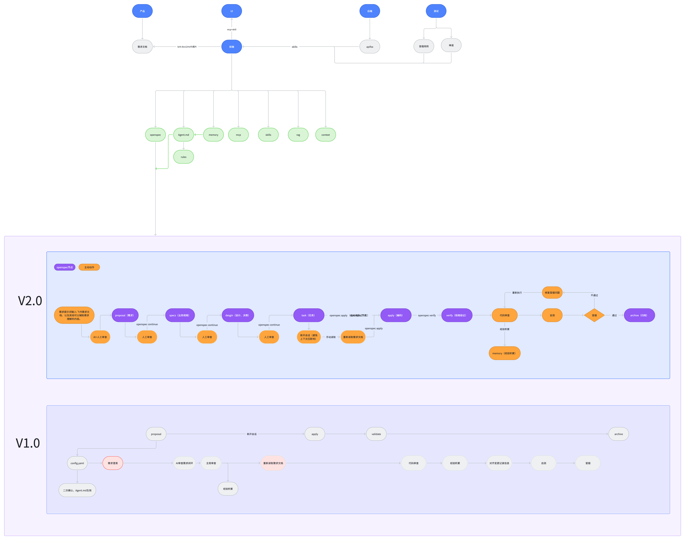

# AI 实践架构：前端协作与 Harness 工程

前端在产研协作中连接需求、设计、接口和测试。本方案围绕这一定位，将材料获取、项目约定、可复用方法、任务执行和验证反馈组织起来，形成可迭代的 Harness 工程方案。

Harness 在这里指模型执行任务所需的工程环境，包括上下文组织、工具接入、流程控制、验证与反馈。整体推进节奏见[AI Coding 跃迁总览](ai-coding-evolution.md)，角色分工见[产研组织协作设计](ai-driven-product-rd-organization-upgrade.md)。

## 架构全图

[查看架构原图](../assets/ai-practice-harness-architecture.png)

图中的 V1.0/V2.0 是本实践方案的迭代标记，不是 OpenSpec 官方版本号，也不代表所有能力都已部署。工具名称和连接方式按当前设计保留，实际执行以业务项目采用的版本与配置为准。

## 跨角色材料如何进入前端任务

| 协作方 | 图中材料或连接 | 需要在任务中保留什么 |
| --- | --- | --- |
| 产品 | 需求文档，lark-docx2md 与图片 | 目标、范围、原始来源、版本及待确认问题 |
| UI | MCP + Skill | 设计信息、页面状态、组件与交互约束 |
| 后端 | Apifox，经 Skills 关联接口信息 | 接口版本、字段含义、错误响应及联调约定 |
| 测试 | 冒烟用例、禅道，经 Skills 关联质量材料 | 验收路径、缺陷与回归范围、实际验证记录 |

前端以这些材料组织本次任务上下文。来源不同的结论发生冲突时，回到对应责任人确认；不能仅因某段内容被工具读取，就把它当作已生效规则。

## 支撑执行的能力

| 图中节点 | 在工程方案中的职责 | 与其他能力的关系 |
| --- | --- | --- |
| OpenSpec | 组织需求、规格、设计、任务、实施与归档 | 承接已确认材料，结合人工审查和运行验证 |
| Agent.md → rules | 项目级指导入口与稳定约束 | 图中 Agent.md 在本仓库对应 AGENTS.md；详细规则按需引用 |
| memory | 保存经过核实、可供后续使用的经验 | 定期确认适用范围，需成为项目规则时经审核再更新入口或引用 |
| MCP | 连接设计、文档等外部工具和数据 | 按权限访问，返回内容仍需检查来源和版本 |
| Skills | 封装特定场景的处理方法与资料入口 | 按任务路由，详细数量与边界见 Skills 规划 |
| RAG | 检索与当前问题有关的资料 | 保留来源，避免过期资料进入当前判断 |
| context | 组织本次执行所需的目标、材料与状态 | 新会话从可靠资料恢复，不依赖旧对话中的隐含结论 |

这些节点描述不同职责，可以由现有工具与文件组合承担，不要求每项都新建独立服务。Skills 的阶段入口和预留数量见[场景与数量规划](../../../company-public/skill-governance/references/ai-coding-skills-planning.md)。

## V1.0：主流程与主动检查并行

V1.0 的主流程为 proposal → apply → validate → archive。图中还安排了 config.yaml 与项目指导文件的二次确认、需求澄清、AI 需求审查、主观审查、经验积累，以及新会话中重新读取需求。

代码审查、经验积累、对齐变更记录信息、自测和冒烟作为主动动作与主流程配合。执行时需要明确这些动作由谁完成、结果存在哪里、未通过时返回哪一步，避免只保留流程节点却遗漏实际检查。

## V2.0：分阶段形成材料并确认

V2.0 将实现前的材料拆得更细，紫色节点表示图中的 OpenSpec 流程，橙色节点表示需要主动执行的审查、重读、测试和经验记录等动作。

| 顺序 | 流程与动作 | 本阶段需要确认的内容 |
| --- | --- | --- |
| 1 | 需求提示词输入，AI + 人工审查 | 飞书需求文档、图片及辅助材料中的目标、缺口与边界 |
| 2 | proposal（需求）→ 人工审查 | 为什么做、做什么、范围与验收方向 |
| 3 | specs（业务规格）→ 人工审查 | 业务规则、场景和可验证条件 |
| 4 | design（设计、决策）→ 人工审查 | 方案、接口、约束和取舍 |
| 5 | task（任务） | 将已确认的方案拆成可执行任务，并关联验证要求 |
| 6 | 新开会话、重新读取需求，再进入 apply（编码） | 恢复任务目标与确认状态；图中也保留当前会话直接继续的路径 |
| 7 | verify（规格验证）→ 代码审查 → 自测 → 冒烟 | 分别确认规格符合度、实现问题、运行结果与关键路径 |
| 8 | 通过后 archive（归档）；不通过则修复并重新检查 | 归档前问题已处理，结论与证据一致 |

图中代码审查关联 memory，用于积累经验。审查发现的内容要先核实，再决定是否进入长期资料；失败猜测和临时假设不直接提升为规则。

新开会话用于控制无关上下文积累，但切换本身不保证质量。重新执行前，应读取需求及对应的规格、设计、任务和已确认决策，保留待处理项。关键规格、代码审查或自测未通过时，同样需要修复并重新验证，不能仅凭冒烟通过放行。

图中的 continue、apply、verify 等标记用于描述阶段衔接。具体命令以目标项目的工具版本和执行约定为准，不将图示直接当作可运行命令表。当前知识仓库只维护方案；业务项目实践还需配套模板、验证器和执行约定，可参考[OpenSpec/SDD 方法说明](../../../company-public/wf-openspec-mode/SKILL.md)。

## 迭代时检查什么

每次调整 Harness，检查输入是否完整、规则是否冲突、Skill 是否正确触发、工具是否在授权范围内工作，以及验证失败是否能回到对应任务。后续收录与效果记录用于判断该保留、简化或替换哪些能力。

## 先确定要解决的协作问题

试点前收集一段完整交付过程中的记录，区分实现耗时、等待确认、评审和返工。只有明确问题出现在哪个环节，才能判断需要补充上下文、调整责任安排，还是增加工具能力。

例如，需求异常流程未确认与已确认结论无法找到，处理方式不同：前者需要业务方判断，后者需要整理和检索。AI 可以发现缺口、关联资料，但无权代替相关角色确认业务事实。

## 信息收录与确认

收录范围可以包括 PRD、原型、接口、会议结论、评审记录、缺陷、Sentry 问题和上线复盘。自动收集需要事先明确授权范围；不将全部聊天内容默认放入共享知识库。

处理流程为：

捕获候选信息 → 去噪与关联 → 责任人确认 → 写入可用资料 → 检查有效性。

每条可复用记录至少保留来源、关联需求或问题、结论、确认人、适用范围和版本或有效期。未确认的信息单独标记，不作为已生效规则供后续任务使用。模型置信度只能帮助筛选，不能代替人工确认。

## 跨环节的信息处理

以下按信息流检查前述能力是否衔接，不另外增加一套工具清单。

| 能力 | 处理的内容 | 关键约束 |
| --- | --- | --- |
| 输入 | 本次任务所需的需求、接口、设计、测试与问题材料 | 检查版本和冲突，保留待确认项 |
| 知识 | 业务规则、组件约束、规范和历史案例 | 有来源、适用范围、维护人和清理机制 |
| Agent 任务 | 需求预审、方案比较、代码审查、用例生成、缺陷分析 | 输出标明假设，关键结论由对应角色确认 |
| 工具集成 | 文档、缺陷系统、Git、CI、Sentry 和通知渠道 | 按任务授予权限，写入和执行遵循审批要求 |
| 数据反馈 | 等待、返工、缺陷、采用结果与维护成本 | 保留统计口径，能关联具体任务与规则版本 |

这些能力可以由现有系统组合承担。只有检索或记录方式无法满足需要时，才增加独立组件，避免让平台维护投入超过试点收益。

## 产研流程与前端实现

产研侧围绕目标确认、共同评审、分工实施、质量验证和复盘更新协作。前端则准备上下文，生成实现草案，完成工程审查、测试联调，再将验证后的做法更新到资料中。

信息收录贯穿这些环节。新结论进入知识库前需要确认；历史规则被新需求推翻时，需要标记失效并通知受影响的任务。测试失败和线上问题也应回查当时使用的输入、假设及规则，确认哪里出了偏差。

前端试点可以覆盖本团队的实现和验证流程。涉及产品、后端或测试的职责调整，应由相应负责人共同确定，不能用前端工具接入替代跨团队协作安排。

## 用结果反查流程问题

单纯统计缺陷数量无法区分业务变化、测试投入与 AI 使用的影响。试点应选择可比范围，同时检查收益、质量和维护成本。

| 问题 | 可观察指标 | 解释时需要保留的信息 |
| --- | --- | --- |
| 是否减少确认与等待 | 澄清轮次、等待时长、未关闭问题 | 需求复杂度、变更情况及确认责任 |
| 是否减少后置返工 | 返工工时、缺陷重开、线上逃逸 | 缺陷严重度、测试范围和样本周期 |
| 是否改善运行质量 | 新增线上问题、无崩溃会话比例、平均恢复时间 | 版本、流量、监控覆盖及故障类型 |
| 知识是否真正被使用 | 有效规则引用、采纳后的结果、重复问题 | 来源版本、适用范围及误用情况 |
| 是否值得继续投入 | 端到端耗时、模型费用、人工审查和维护投入 | 原有基线、任务规模及成本口径 |

例如，规则被引用但对应问题仍然反复出现，应检查规则本身、检索结果、执行步骤或验证覆盖。不能直接把引用次数计为收益。

## 治理要求

- 明确可用场景、数据分类、模型访问范围与人工确认点。
- 保留关键输入、输出、评审、执行和规则更新记录，避免将敏感原文无差别写入日志。
- 为知识维护、任务运行和异常处理分别指定责任人。
- 定期检查过期信息、误判、权限问题及失败处理方式。
- 在试点复盘中决定继续、调整或退出，并记录判断依据。

架构是否有效，最终要回到具体问题：各角色能否找到同一份有效约定，待确认事项是否更早解决，生成结果是否经过验证，以及下一次交付是否避免了同类错误。
