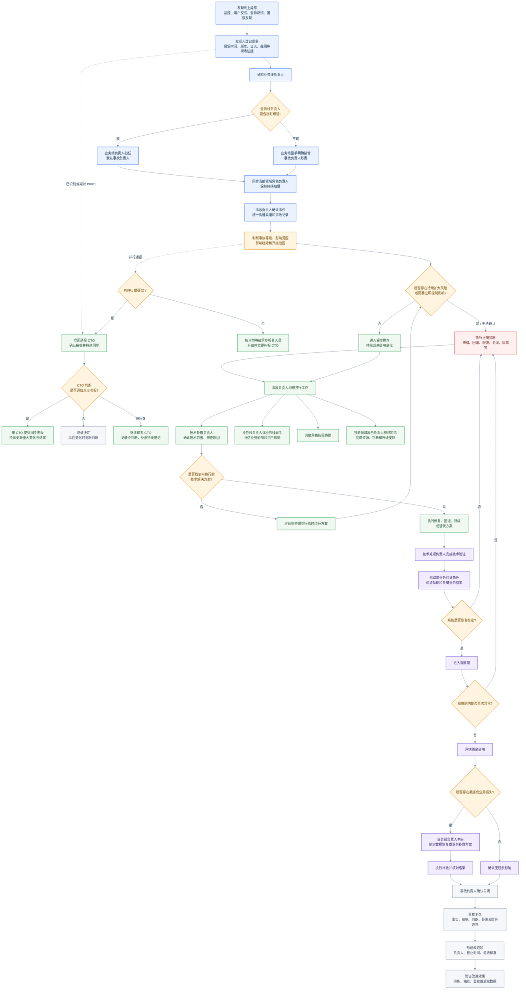

# 通用线上事故响应流程

> 版本：V1.14（执行版）
>
> 适用范围：前端、后端、测试、运维、产品、运营等角色参与的线上事故响应

## 执行状态与版本管理

- 2026-10-09 更新确认：此前已完成线上事故响应机制宣讲，团队较为认可，当前无异议；V1.13 已记录为执行版本。
- V1.14 补充 P0/P1 立即通报 CTO、由 CTO 判断老板知情范围及简短初报格式。本次新增规则的团队同步尚未记录，需随版本更新同步相关人员。
- 宣讲具体日期、参与范围和会议材料尚未记录；本次更新日期不作为宣讲日期。
- 后续将开展演练，验证接管、止损、并行核查、恢复和关闭的实际响应能力；演练时间、参与人员及结果待补充。
- 后续调整通过版本更新管理，记录版本号、变更原因、具体调整和执行口径，并同步相关人员。
- 当前已完成机制建立和宣讲；效果待演练及实际运行验证。本次事故的数据补救、整改验收与关闭继续单独跟踪。

## 一、适用范围与原则

- 先判断影响，再排查原因；无法判断时按高风险处理。
- 先止损，再修复；恢复稳定后再处理残余影响和业务补救。
- 发现人负责上报，事故负责人负责协调，技术处理负责人负责解决。
- P0/P1 立即通报 CTO，由 CTO 动态判断是否通知对应老板；初报先同步已知事实和风险，通报与止损并行。
- 结论、时间承诺和关闭结果必须留痕。

标准链路：

```text
发现与上报
→ 影响判断
→ 止损与隔离
→ 技术排查和方案执行
→ 恢复验证与观察
→ 残余影响、数据恢复和业务补救
→ 事故关闭与复盘
```

## 二、角色模型与职责

### 2.1 专业总角色

专业总角色统一为：前端、后端、测试、运维、产品、运营。每起事故确定一个当前领域主责角色，其他角色按需协助。

### 2.2 事故流程角色

| 流程角色 | 主要职责 | 参与条件 |
| --- | --- | --- |
| 发现人 | 记录现象、保留证据、及时上报，并配合补充信息 | 发现异常时 |
| 事故负责人（默认由业务线负责人担任） | 统一判断、协调、升级、止损决策和事故关闭；确保 P0/P1 及时通报 CTO | 线上事故必设 |
| 业务线副手 | 业务线负责人无法及时跟进时，明确接管事故负责人职责 | 按需 |
| 当前领域角色负责人 | 提供本领域专业判断、资源和升级支持，协助确认 P0/P1 已通报 CTO，发现遗漏及时补报 | 默认知情，升级或需要资源时介入 |
| 技术处理负责人 | 确认技术范围，负责原因排查、修复或回退及技术验证 | 线上事故必设 |
| 业务验证负责人 | 确认关键业务流程、用户影响是否停止以及业务是否恢复 | 涉及业务影响或恢复验证时 |
| 记录与沟通负责人 | 由事故负责人指定，优先从产品、运营或测试角色中选择；维护时间线、决策、风险、行动项和统一进展同步 | P0 或跨团队事故建议设置 |

其他角色按需协助，不承担事故统筹责任。

同一人可以兼任多个流程角色，但 P0 事故原则上应将事故负责人和技术处理负责人分开；兼任关系必须在事故记录中明确。

CTO 是 P0/P1 必须通报的管理角色，负责判断是否通知对应老板，以及是否需要管理层提前协调资源、业务沟通或采取其他措施。向 CTO 通报不自动改变事故负责人，止损和排查按原职责持续推进。

### 2.3 升级与接管规则

业务线负责人默认担任本线事故负责人；无法及时跟进时，由业务线副手明确接管，并获得信息收集、人员召集、止损建议、升级和进展同步权限。

当前领域角色负责人默认知情，不共同指挥。以下情况应升级、协调或接管：

- 影响范围或影响趋势无法确认；
- 涉及关键业务、核心链路、重要客户、数据完整性、资金、安全或合规风险；
- 影响持续扩大或无法止损；
- 需要跨团队调度资源；
- 业务线负责人和业务线副手均无法及时响应；
- 超过组织配置的排查、止损或恢复时限。

接管关系：

```text
业务线负责人
→ 业务线副手
→ 临时事故负责人
```

当业务线负责人和业务线副手均无法推进时，由当前领域角色负责人协调指定临时事故负责人，但不自动成为事故负责人。跨业务线或重大事故需要统一调度时，由当前事故负责人发起升级并由组织指定统一负责人。

原负责人恢复可用后，是否交回事故负责人职责，由当前事故负责人确认并完成信息交接。
协助角色只承担专业协助，不承担事故统筹责任。

## 三、信息来源与问题入口

| 类型 | 来源 | 要求 |
| --- | --- | --- |
| 外部 | 线上维护群、业务或用户反馈 | 30 分钟内初步回复；当天给出方案或进展；结论回填记录 |
| 内部 | 服务器监测、日志、埋点、Sentry | 无业务反馈也按实际影响判断，必要时启动事故响应 |

上述初步回复时限不替代紧急通报要求；已识别或疑似 P0/P1 时，立即按 3.3 节同步 CTO。

### 3.1 启动条件

满足以下任一条件，立即启动线上事故响应：

- 核心功能不可用或明显降级；
- 存在数据完整性、资金、安全或合规风险；
- 影响范围或趋势无法确认，或异常仍可能持续产生；
- 需要回退、降级、限流、关闭功能或跨团队调度；
- 影响多个业务线、重要客户或关键交付结果。

### 3.2 事故等级

| 等级 | 判定原则 | 响应要求 | 修复要求 |
| --- | --- | --- | --- |
| P0 | 核心链路中断、数据持续错误或不可恢复、重大资金/安全/合规风险，或影响持续扩大 | 立即接管并通报 CTO、优先止损，暂停非必要工作，持续同步进展 | 1-4 个工作小时内响应解决，修复后立即通知验证 |
| P1 | 关键功能受影响、影响范围可控或存在替代方案 | 立即通报 CTO，尽快组织处理，明确负责人、方案和恢复时间 | 1 个工作日内响应解决，修复后完成验证 |
| P2 | 局部功能或少量用户受影响，不影响核心链路 | 纳入事故跟踪，按计划修复并完成验证 | 2 个工作日内响应解决，修复后完成验证 |

修复时限按工作时间计算，具体判定口径见附件：[Bug 优先级 + 严重程度判定 + 修复要求](https://w74x12qb16.feishu.cn/wiki/WC2KwD5owiuiP1kVWJacBAFTnjc?fromScene=spaceOverview)。

所有入口均需保留版本、环境、日志、截图或录屏等证据；涉及核心业务、数据完整性、安全或持续扩大风险时，立即升级。

事故处理中，P0 默认每 30 分钟同步进展；P1、P2 按关键节点同步。所有等级发生止损、修复上线、影响扩大等重大变化时立即同步。

### 3.3 内部通报层级与处理步骤

内部信息应及时到达需要作出判断的人，避免业务方或客户先找到 CTO 或老板时，管理层尚不了解情况，错过提前沟通和采取措施的时机。

| 事故等级 | 必须通报范围 | 老板知情安排 |
| --- | --- | --- |
| P0、P1 | 事故负责人、当前领域角色负责人、CTO，以及相关技术、产品和业务协作人员 | 由 CTO 根据影响、趋势、客户风险和协调需要，动态决定是否通知对应老板、通知时机和范围，并安排同步 |
| P2 | 业务线负责人、当前领域角色负责人及相关技术、产品和业务协作人员 | 影响扩大或需上级协调时及时升级；一旦升级为 P0/P1，立即通报 CTO |

1. **发现即初报。** 发现人向业务线负责人和当前领域角色负责人同步现象、发现时间和初步影响。已识别或疑似 P0/P1 时，同时通报 CTO，注明初判或待确认，不等待根因、全量数据或完整报告。
2. **明确接管与通报责任。** 事故负责人接管后确认等级、人员分工和通知范围，可指定记录与沟通负责人发送后续通报，但仍对信息送达负责。负责人暂时无法响应时，发现人或已知情的当前领域角色负责人先完成紧急通报，接管按第二章继续推进。
3. **确认 CTO 知情。** 在飞书或约定沟通渠道明确提醒 CTO；未获接收确认时，通过电话等直接方式补充联系，记录已发送、已确认或仍在联系。联系过程与止损、排查并行。
4. **由 CTO 判断老板通报。** CTO 决定是否通知对应老板及由谁同步。记录决定；尚未反馈时记为“待 CTO 判断”，不能把未回复当作无需通知。影响扩大、客户升级或出现新的业务风险时，再同步 CTO 重新判断。
5. **持续更新到关闭。** 沿用本章同步频率，向已纳入范围的相关人员更新影响、处置、风险与下一次同步时间，P0/P1 必须包含 CTO。等级升降均说明依据；恢复、关闭及复盘结论继续同步原通知范围，老板侧按 CTO 安排同步。

初报使用第八章简短格式。信息不全时写“待确认”，先让相关人员知道问题正在发生、谁在处理、风险是什么。团队按统一事故记录对外解释，避免不同人员给出相互矛盾的原因或恢复时间。

历史通报口径及本次采用边界见[线上问题通报层级参考](../.agents/skills/frontend-leadership/org-architect/references/incident-notification-levels.md)。

## 四、通用事故响应流程

等级判断后，管理通报与止损判断并行。发现时已识别或疑似 P0/P1 的，立即初报 CTO；后续升级同样触发通报，不等待接管完成或管理层回复。



## 五、阶段职责

| 阶段 | 主责角色 | 必须协助角色 | 阶段输出 |
| --- | --- | --- | --- |
| 发现与上报 | 发现人 | 业务线负责人 | 现象、时间、现场证据、初步影响 |
| 启动判断 | 业务线负责人或业务线副手 | 当前领域角色负责人、技术处理负责人 | 是否启动事故响应、初始等级和事故负责人 |
| 事故组织 | 事故负责人 | 记录与沟通负责人、当前领域角色负责人 | 沟通渠道、人员分工、更新时间和决策记录 |
| 分级通报 | 事故负责人；接管前由发现人或已知情的当前领域角色负责人先行通报 | 记录与沟通负责人、当前领域角色负责人；P0/P1 必须通报 CTO | 初报、接收确认、后续进展及 CTO 对老板通报的决定和执行记录 |
| 影响评估 | 业务线负责人或业务线副手 | 技术处理负责人、产品、运营及其他相关总角色 | 影响对象、范围、时间、趋势和风险 |
| 技术排查 | 技术处理负责人 | 当前领域角色成员及相关协助角色 | 技术范围、原因假设、证据和候选方案 |
| 止损决策 | 事故负责人 | 技术处理负责人、业务线负责人、当前领域角色负责人及相关协助角色 | 止损方式、执行人、范围和回退条件 |
| 技术恢复 | 技术处理负责人 | 当前领域角色成员及相关协助角色 | 修复、回退、降级或替代方案及验证结果 |
| 业务恢复 | 业务验证负责人 | 业务线负责人、技术处理负责人、业务代表 | 关键业务结果恢复确认 |
| 残余影响处理 | 业务线负责人或业务线副手 | 产品、运营及其他相关协助角色 | 数据恢复、业务补救或不可恢复边界 |
| 事故关闭 | 事故负责人 | 业务线负责人、技术和业务验证角色、当前领域角色负责人 | 关闭结论、观察结果和遗留事项 |
| 复盘改进 | 事故负责人 | 相关责任人、当前领域角色负责人及相关协助角色 | 复盘报告、改进项、验收标准和复测证据 |

## 六、事故关闭条件

修复、回退或降级完成后，默认观察不少于 1 小时；数据完整性事故应在修复完成后 1 天内完成影响、数据和业务复核。若业务数据产生周期超过 1 天，以覆盖完整业务周期为准。

同时满足以下条件，事故负责人才能关闭事故：

- 技术方案已经上线或完成明确的临时替代；
- 关键功能、监控和业务结果已经验证恢复；
- 观察期内没有新增异常或影响扩大；
- 已确认是否存在残余数据、业务或用户影响；
- 数据恢复、业务补救或不可恢复边界已经明确；
- 未完成事项已登记负责人、截止时间和后续验证方式；
- 事故时间线和关键决策已经留痕。

关闭结论同步原通知范围；P0/P1 同步 CTO，对应老板按 CTO 安排同步。技术恢复通知需明确是否仍有残余数据或业务影响，避免将“已上线”通报为“事故已关闭”。

## 七、复盘要求

事故复盘至少回答：

1. 发生了什么，事实时间线是什么？
2. 用户、业务、数据或系统受到了什么影响？
3. 哪些结论已经有证据，哪些仍待补证？
4. 直接原因、技术原因、流程原因和组织原因分别是什么？
5. 哪些止损动作及时，哪些动作延迟或缺失？
6. 谁承担了事故协调、技术处理、业务判断和恢复验证责任？
7. 哪些改进项可以阻断复发，如何验收？
8. 是否需要通过演练验证团队的实际响应能力？

其中响应复盘需检查：何时识别为 P0/P1、何时通报 CTO、是否确认接收、CTO 对老板通报作何安排，以及是否存在业务方先向管理层反馈而内部信息尚未到达的情况。记录实际证据，区分未执行与未留痕。

改进项不能只写“加强测试”“提高意识”或“完善流程”，必须写清：

```text
改进事项 + 责任人 + 截止时间 + 验收标准 + 验收证据
```

## 八、事故记录与模板

> 当前状态：简短通报格式已提供；飞书模板链接、完整时间线模板和完整复盘模板待补充。
>
> 补充位置：本节维护飞书模板链接和使用说明。

| 模板 | 用途 | 飞书链接 |
| --- | --- | --- |
| 事故通知模板 | 先使用下方简短格式，覆盖初报、进展与恢复/关闭通报 | 待补充 |
| 事故时间线模板 | 记录时间、事件、证据、判断、决策和执行人 | 待补充 |
| 事故复盘模板 | 记录影响、原因、响应复盘、改进项和关闭确认 | 待补充 |

### 8.1 首次通报：先同步已知信息

```text
【线上事故初报｜P0/P1/P2/疑似，待确认｜业务名称】
发现时间：
现象与已知影响：谁、什么功能或数据受到影响；未知范围写“待确认”
当前风险与处置：是否持续产生异常；已采取或正在采取的止损动作
当前联系人/事故负责人：姓名；未接管时先写发现人
需要支持：
下次同步：具体时间（P0 按每 30 分钟要求安排）
事故记录/证据链接：暂无可后补
```

P0/P1 初报立即提醒 CTO 及相关负责人。通报后在事故记录中补充发送时间、接收确认、CTO 对老板通报的决定及实际执行情况；不等待这些记录齐全才发初报。

### 8.2 后续通报：沿用同一事故记录

```text
【事故进展/恢复/关闭｜当前等级｜业务名称｜更新时间】
影响与风险变化：
已完成动作及验证结果：
当前状态与遗留事项：处理中/观察中/补救中/已关闭，附负责人
需要支持与下一步：
下次同步：未关闭时填写具体时间
事故记录/复盘链接：
```

## 九、场景处置卡

通用流程不承载具体业务处置细节。以下场景应按需独立维护处置卡，并在事故响应中引用：

- [数据异常或数据完整性事故](incident-card-data-integrity.md)；
- 发布、回退和热更新事故；
- 核心功能不可用；
- 性能、稳定性和容量事故；
- 安全、权限和合规事件；
- 第三方依赖或基础设施故障。

场景处置卡只能补充具体检查项，不能改变本流程的角色接管、止损优先、恢复验证和复盘闭环原则。
