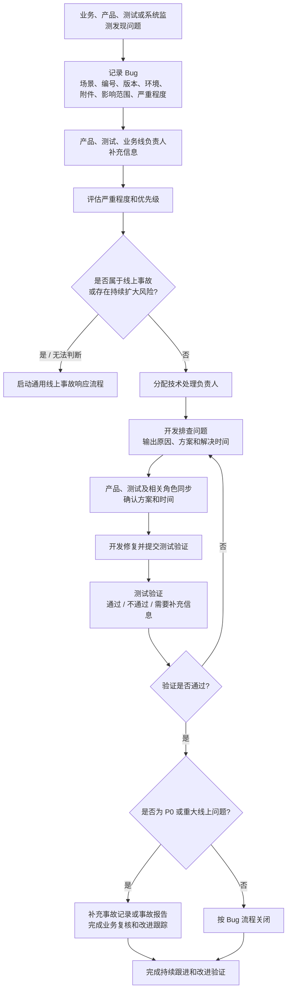
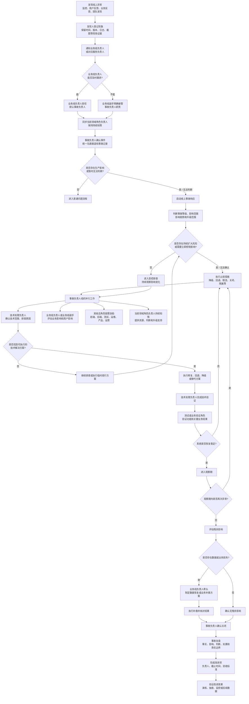

# 通用线上事故响应流程

> 版本：V1.1（草案）
>
> 适用范围：前端、后端、测试、运维、产品、运营等角色参与的线上事故响应

## 一、适用范围与原则

- 先判断影响，再排查原因；无法判断时按高风险处理。
- 先止损，再修复；恢复稳定后再处理残余影响和业务补救。
- 发现人负责上报，事故负责人负责协调，技术处理负责人负责解决。
- 结论、时间承诺和关闭结果必须留痕。

标准链路：

```text
发现与上报
→ 影响判断
→ 止损与隔离
→ 技术排查和方案执行
→ 恢复验证与观察
→ 残余影响、数据恢复和业务补救
→ 事故关闭与复盘
```

## 二、角色模型与职责

### 2.1 总角色

专业角色统一为：前端、后端、测试、运维、产品、运营。每起事故确定一个当前领域角色，其余角色按需协助；事故负责人、技术处理负责人等属于流程角色，不限定专业领域。

| 通用角色 | 默认职责 | 是否默认参与每起事故 |
| --- | --- | --- |
| 发现人 | 记录现象、保留证据、及时上报，并配合补充信息 | 是 |
| 业务线负责人 / 服务负责人 | 默认担任本业务线事故负责人，负责影响判断、协调、升级和关闭 | 生产影响事故是 |
| 业务线副手 | 业务线负责人无法及时跟进时，明确接管事故负责人职责 | 按需 |
| 当前领域角色负责人 | 持续了解本领域问题，提供专业判断、资源和升级支持 | 保持知情，按需介入 |
| 技术处理负责人 | 负责技术范围确认、原因排查、修复或回退以及技术验证 | 生产影响事故是 |
| 协助角色 | 从其他总角色中按需选择参与，例如当前领域为前端时，由后端、测试、运维、产品或运营协助 | 按需 |
| 业务验证负责人 | 确认关键业务流程、用户影响是否停止以及业务是否恢复 | 按需 |
| 记录与沟通负责人 | 维护时间线、决策、风险、行动项和统一进展同步 | P0 或跨团队事故建议设置 |

### 2.2 接管规则

业务线负责人默认担任本线事故负责人；无法及时跟进时，由业务线副手明确接管，并获得信息收集、人员召集、止损建议、升级和进展同步权限。

当前领域角色负责人默认知情，不共同指挥；升级、协调和接管条件见第九章。协助角色只承担专业协助，不承担事故统筹责任。

## 三、信息来源与问题入口

| 来源 | 要求 |
| --- | --- |
| 线上维护群、业务或用户反馈 | 30 分钟内初步回复；当天给出方案或进展；结论回填记录 |
| 服务器监测、日志、埋点、Sentry | 无业务反馈也按实际影响判断，必要时启动事故响应 |
| 禅道、测试记录、研发排查记录 | 创建或关联 Bug 单，维护状态、优先级、处理人和关键时间 |

所有入口均需保留版本、环境、日志、截图或录屏等证据；涉及核心业务、数据完整性、安全或持续扩大风险时，立即升级。

## 四、线上 Bug 跟踪流程

### 4.1 Bug 跟踪主流程



### 4.2 Bug 单最小信息

Bug 单至少应包含：

- 问题场景和复现步骤；
- Bug 编号、发现时间、发现渠道；
- 版本、环境、设备或系统信息；
- 截图、录屏、日志、埋点或其他附件；
- 影响范围、影响趋势和严重程度；
- 优先级、处理人、测试验证人和相关业务线；
- 解决方案、预计解决时间、实际解决时间和验证结论。

### 4.3 Bug 时限规则

1. 修复要求的解决时间从 Bug 单创建时间开始计算，按工作时间统计。
2. 临近需求可验收时间或临近热更新环境版本时间时，涉及本次上线迭代的 Bug 应相应提高优先级，对应开发人员优先处理。
3. 版本上线前的热更新环境回归中发现 Bug，对应开发人员应立即响应解决；开发人员正在处理线上问题时，按事故负责人统一调度优先级。
4. 测试人员对每天 18:00 前提交的待验证 Bug，原则上做到当日验证完成；未完成时必须同步原因和预计验证时间。
5. P0 Bug 原则上当日清除；如果已涉及线上用户、核心链路、数据完整性或持续扩大风险，必须同时遵循线上事故响应流程中更严格的升级、止损和关闭要求。

### 4.4 疑难问题处理

#### 个人排查阶段：0.5-1 个工作日

开发人员先查阅文档、历史案例和问题记录，必要时使用 AI 辅助分析并自行验证；同时输出问题现象、已尝试方案和当前结论。

满足以下任一条件，应主动升级并寻求团队协助：

- 连续排查超过 0.5 个工作日无进展；
- 已达到约定解决时间仍未解决；
- 影响范围或风险无法判断；
- 怀疑存在跨模块、跨角色或系统性问题。

#### 团队疑难问题处理阶段：1-2 个工作日

由模块负责人、较高职级开发人员或项目负责人组织处理：同步证据，指定唯一技术处理负责人，必要时开展代码评审、架构评审或技术预研，并每日记录方案、风险、进展和下一步行动。

满足以下任一条件，应升级至当前领域角色负责人和相关协助角色：

- 超过 2 个工作日仍未定位根因；
- 涉及架构设计调整；
- 涉及多个总角色或多个业务线协作；
- 存在较大交付风险、上线风险或用户影响。

#### 研发风险点处理

团队无法在当前周期解决时，应同步产品、测试和业务线负责人，将问题纳入研发风险点，并明确影响、临时方案、计划版本、风险接受人和验证方式。

## 五、Bug 优先级与严重程度判定

以下规则主要适用于非线上环境或尚未达到线上事故标准的 Bug。线上事故、数据完整性问题和持续扩大问题优先执行事故响应流程。

| 严重程度 | 定义与典型示例 | 非线上环境对应优先级 | 修复要求 | 判定关键依据 |
| --- | --- | --- | --- | --- |
| 致命 | 测试环境不可用、核心功能完全瘫痪、数据丢失或污染且无法恢复。例如环境启动失败、核心全链路中断、测试数据生成或回滚失败 | P0 | 1-4 个工作小时内响应并解决，暂停其他开发任务，修复后立即通知测试验证 | 直接阻断全量测试执行，版本提测停滞 |
| 严重 | 核心功能失效，但测试环境未完全阻塞，存在临时替代方案。例如主流机型核心页面闪退、核心接口参数错误 | 核心流程阻塞时 P0；有替代方案时 P1 | P0：1-4 个工作小时内响应并解决；P1：1 个工作日内响应并解决 | 影响核心测试场景覆盖或关键用例执行 |
| 一般 | 非核心功能失效，主要流程可绕开完成。例如收藏排序错误、非必填字段校验错误、辅助功能加载失败 | 高频非核心功能 P1；低频非核心功能 P2 | P1：1 个工作日内响应并解决；P2：2 个工作日内响应并解决 | 影响部分测试用例，但不阻碍核心流程验证 |
| 次要 | 不影响功能使用的 UI、文案或交互细节问题。例如轻微位置偏移、错别字、提示语不精准 | 核心页面 P1；普通页面 P2；边缘页面 P3 | P1：1 个工作日内响应并解决；P2：2 个工作日内响应并解决；P3：当前迭代按计划修复或纳入后续迭代 | 不影响测试执行，主要影响体验或美观 |
| 建议 | 非缺陷性质的功能或体验优化建议 | P4 | 按需评估，纳入产品规划，不占用当前迭代资源 | 不影响现有功能，主要用于提升效率或体验 |

## 六、特殊场景处理

### 6.1 评估为非 Bug

若开发评估后认为问题不是 Bug，而是需要新增或调整的需求：

1. 开发同步产品和测试，说明判断依据；
2. 产品完成需求登记并明确后续版本；
3. 测试确认结论后，由对应测试人员关闭原 Bug；
4. 原 Bug 与新需求建立关联，避免问题失去追踪。

### 6.2 当前迭代无法完成修复

若 Bug 需要延期处理：

1. 开发同步产品和测试并达成一致；
2. 测试在 Bug 标题末尾标注“--后续版本解决”；
3. Bug 状态保持未关闭；
4. 处理人继续保持为开发人员；
5. 明确后续版本、解决时间、临时规避方案和风险接受人。

### 6.3 偶现、长期无法复现或边界场景

针对偶现、长期无法复现或仅在边界条件下触发的 Bug：

1. 开发主动联合产品和测试分析现象、影响和复现条件；
2. 必要时补充日志、埋点、监控或专项验证；
3. 由产品、测试和开发共同达成是否关闭的结论；
4. 确认可以关闭后，开发在提交验证时注明具体原因和证据；
5. 由对应测试人员执行关闭操作。

## 七、通用事故响应流程



## 八、阶段职责

| 阶段 | 主责角色 | 必须协助角色 | 阶段输出 |
| --- | --- | --- | --- |
| 发现与上报 | 发现人 | 业务线负责人 / 服务负责人 | 现象、时间、现场证据、初步影响 |
| 启动判断 | 业务线负责人或业务线副手 | 当前领域角色负责人、技术处理负责人 | 是否启动事故响应、初始等级和事故负责人 |
| 事故组织 | 事故负责人 | 记录与沟通负责人、当前领域角色负责人 | 沟通渠道、人员分工、更新时间和决策记录 |
| 影响评估 | 业务线负责人或业务线副手 | 技术处理负责人、产品、运营及其他相关总角色 | 影响对象、范围、时间、趋势和风险 |
| 技术排查 | 技术处理负责人 | 当前领域角色成员及相关协助角色 | 技术范围、原因假设、证据和候选方案 |
| 止损决策 | 事故负责人 | 技术处理负责人、业务线负责人、当前领域角色负责人及相关协助角色 | 止损方式、执行人、范围和回退条件 |
| 技术恢复 | 技术处理负责人 | 当前领域角色成员及相关协助角色 | 修复、回退、降级或替代方案及验证结果 |
| 业务恢复 | 业务验证负责人 | 业务线负责人、技术处理负责人、业务代表 | 关键业务结果恢复确认 |
| 残余影响处理 | 业务线负责人或业务线副手 | 产品、运营及其他相关协助角色 | 数据恢复、业务补救或不可恢复边界 |
| 事故关闭 | 事故负责人 | 业务线负责人、技术和业务验证角色、当前领域角色负责人 | 关闭结论、观察结果和遗留事项 |
| 复盘改进 | 事故负责人 | 相关责任人、当前领域角色负责人及相关协助角色 | 复盘报告、改进项、验收标准和复测证据 |

## 九、升级与接管规则

### 9.1 必须升级的情况

- 影响范围或影响趋势无法确认；
- 事故涉及关键业务、核心链路或重要客户；
- 影响持续扩大或无法止损；
- 需要跨团队调度资源；
- 涉及数据完整性、资金、安全或合规风险；
- 业务线负责人和业务线副手均无法及时响应；
- 超过组织配置的排查、止损或恢复时限。

### 9.2 接管顺序

```text
业务线负责人
→ 业务线副手
→ 当前领域角色负责人指定临时事故负责人
→ 当前领域角色负责人接管重大决策和跨团队协调
```

原负责人恢复可用后，是否交回事故负责人职责，需要由当前事故负责人确认，并完成信息交接，不能自动切换导致指挥混乱。

## 十、事故关闭条件

同时满足以下条件，事故负责人才能关闭事故：

- 技术方案已经上线或完成明确的临时替代；
- 关键功能、监控和业务结果已经验证恢复；
- 观察期内没有新增异常或影响扩大；
- 已确认是否存在残余数据、业务或用户影响；
- 数据恢复、业务补救或不可恢复边界已经明确；
- 未完成事项已登记负责人、截止时间和后续验证方式；
- 事故时间线和关键决策已经留痕。

## 十一、复盘要求

事故复盘至少回答：

1. 发生了什么，事实时间线是什么？
2. 用户、业务、数据或系统受到了什么影响？
3. 哪些结论已经有证据，哪些仍待补证？
4. 直接原因、技术原因、流程原因和组织原因分别是什么？
5. 哪些止损动作及时，哪些动作延迟或缺失？
6. 谁承担了事故协调、技术处理、业务判断和恢复验证责任？
7. 哪些改进项可以阻断复发，如何验收？
8. 是否需要通过演练验证团队的实际响应能力？

改进项不能只写“加强测试”“提高意识”或“完善流程”，必须写清：

```text
改进事项 + 责任人 + 截止时间 + 验收标准 + 验收证据
```

## 十二、场景处置卡

通用流程不承载具体业务处置细节。以下场景应按需独立维护处置卡，并在事故响应中引用：

- 数据异常或数据完整性事故；
- 发布、回退和热更新事故；
- 核心功能不可用；
- 性能、稳定性和容量事故；
- 安全、权限和合规事件；
- 第三方依赖或基础设施故障。

场景处置卡只能补充具体检查项，不能改变本流程的角色接管、止损优先、恢复验证和复盘闭环原则。
