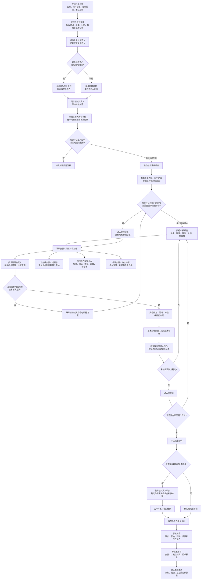

# 通用线上事故响应流程

> 版本：V1.0（草案）
>
> 适用范围：前端、后端、客户端、平台及其他研发团队的线上事故响应
>
> 文档定位：定义线上事故的通用响应链路、角色职责、接管规则和关闭条件。具体数据异常、发布故障、性能故障、安全事件等场景，另行维护场景处置卡。

## 一、流程目标

建立一套不依赖具体技术栈和业务对象的线上事故响应机制，确保团队能够：

1. 及时识别线上影响，不等待影响扩大后才升级。
2. 在原因未完全确认前，先控制风险和影响范围。
3. 明确谁负责事故协调、技术处理、业务判断和恢复验证。
4. 在技术问题解决后，再评估残余影响、数据恢复和业务补救。
5. 通过复盘、改进和演练，把一次事故转化为可复用的组织能力。

## 二、核心原则

### 2.1 先判断影响，再判断原因

线上问题是否需要启动事故响应，首先看是否影响生产用户、业务连续性、数据完整性、安全或重要交付结果，而不是先等待技术原因确认。

### 2.2 无法判断时按高风险处理

当暂时无法确认影响范围、影响趋势或是否仍在持续产生异常时，默认保留风险，先进行升级、监控和必要止损。

### 2.3 先止损，再解决；先恢复，再补救

处理顺序统一为：

```text
发现与上报
→ 影响判断
→ 止损与隔离
→ 技术排查和方案执行
→ 恢复验证与观察
→ 残余影响、数据恢复和业务补救
→ 事故关闭与复盘
```

### 2.4 事故负责人不等于技术处理负责人

事故负责人负责统一协调、风险判断、资源调度和关键决策；技术处理负责人负责定位、修复、回退和技术验证。两者可以由同一人兼任，但必须明确兼任关系。

### 2.5 发现人负责上报，不要求先完成定位

发现人应保留现场信息并及时上报，不应因为原因不明、影响范围不明或尚未复现而延迟通知。

## 三、角色定义

| 通用角色 | 默认职责 | 是否默认参与每起事故 |
| --- | --- | --- |
| 发现人 | 记录现象、保留证据、及时上报，并配合补充信息 | 是 |
| 业务线负责人 / 服务负责人 | 默认担任本业务线事故负责人，负责影响判断、协调、升级和关闭 | 生产影响事故是 |
| 副手 | 业务线负责人无法及时跟进时，明确接管事故负责人职责 | 按需 |
| 领域负责人 | 对相关专业或组织领域承担整体责任，例如前端负责人、后端负责人、平台负责人 | 保持知情，按需介入 |
| 技术处理负责人 | 负责技术范围确认、原因排查、修复或回退以及技术验证 | 生产影响事故是 |
| 协作角色 | 按事故类型提供后端、测试、数据、运维、基础设施、安全、客服或运营支持 | 按需 |
| 业务验证负责人 | 确认关键业务流程、用户影响是否停止以及业务是否恢复 | 按需 |
| 记录与沟通负责人 | 维护时间线、决策、风险、行动项和统一进展同步 | P0 或跨团队事故建议设置 |

### 3.1 事故负责人默认规则

业务线负责人或服务负责人默认担任本线事故负责人，适用于单一业务线、影响范围可控的事故。

业务线负责人无法及时跟进时，由副手明确接管。接管不能只是“先帮忙看一下”，应同步授予：

- 事故信息收集和统一同步权；
- 相关人员和协作团队召集权；
- 止损建议和升级权；
- 进展记录和恢复验证推动权。

### 3.2 领域负责人规则

领域负责人默认保持持续知情，不与事故负责人形成共同指挥关系。以下情况由领域负责人升级、协调或接管：

- 影响多个业务线或多个技术团队；
- 涉及重大数据、资金、安全、合规或客户信任风险；
- 需要跨团队统一调度资源；
- 业务线负责人和副手都无法推进；
- 事故持续扩大或超过组织配置的响应时限；
- 事故负责人需要更高层进行优先级裁决。

## 四、通用响应流程



## 五、阶段职责

| 阶段 | 主责角色 | 必须协助角色 | 阶段输出 |
| --- | --- | --- | --- |
| 发现与上报 | 发现人 | 业务线负责人 / 服务负责人 | 现象、时间、现场证据、初步影响 |
| 启动判断 | 业务线负责人或副手 | 领域负责人、技术处理负责人 | 是否启动事故响应、初始等级和事故负责人 |
| 事故组织 | 事故负责人 | 记录与沟通负责人、领域负责人 | 沟通渠道、人员分工、更新时间和决策记录 |
| 影响评估 | 业务线负责人或副手 | 技术处理负责人、业务代表、数据和依赖团队 | 影响对象、范围、时间、趋势和风险 |
| 技术排查 | 技术处理负责人 | 模块成员、后端、架构、基础设施等 | 技术范围、原因假设、证据和候选方案 |
| 止损决策 | 事故负责人 | 技术处理负责人、业务线负责人、领域负责人 | 止损方式、执行人、范围和回退条件 |
| 技术恢复 | 技术处理负责人 | 测试、发布、后端、运维等 | 修复、回退、降级或替代方案及验证结果 |
| 业务恢复 | 业务验证负责人 | 业务线负责人、技术处理负责人、业务代表 | 关键业务结果恢复确认 |
| 残余影响处理 | 业务线负责人或副手 | 数据、后端、客服、运营、法务等 | 数据恢复、业务补救或不可恢复边界 |
| 事故关闭 | 事故负责人 | 业务线负责人、技术和业务验证角色、领域负责人 | 关闭结论、观察结果和遗留事项 |
| 复盘改进 | 事故负责人 | 相关责任人、领域负责人、质量负责人 | 复盘报告、改进项、验收标准和复测证据 |

## 六、升级与接管规则

### 6.1 必须升级的情况

- 影响范围或影响趋势无法确认；
- 事故涉及关键业务、核心链路或重要客户；
- 影响持续扩大或无法止损；
- 需要跨团队调度资源；
- 涉及数据完整性、资金、安全或合规风险；
- 业务线负责人和副手均无法及时响应；
- 超过组织配置的排查、止损或恢复时限。

### 6.2 接管顺序

```text
业务线负责人
→ 业务线副手
→ 领域负责人指定临时事故负责人
→ 领域负责人接管重大决策和跨团队协调
```

原负责人恢复可用后，是否交回事故负责人职责，需要由当前事故负责人确认，并完成信息交接，不能自动切换导致指挥混乱。

## 七、事故关闭条件

同时满足以下条件，事故负责人才能关闭事故：

- 技术方案已经上线或完成明确的临时替代；
- 关键功能、监控和业务结果已经验证恢复；
- 观察期内没有新增异常或影响扩大；
- 已确认是否存在残余数据、业务或用户影响；
- 数据恢复、业务补救或不可恢复边界已经明确；
- 未完成事项已登记负责人、截止时间和后续验证方式；
- 事故时间线和关键决策已经留痕。

## 八、复盘要求

事故复盘至少回答：

1. 发生了什么，事实时间线是什么？
2. 用户、业务、数据或系统受到了什么影响？
3. 哪些结论已经有证据，哪些仍待补证？
4. 直接原因、技术原因、流程原因和组织原因分别是什么？
5. 哪些止损动作及时，哪些动作延迟或缺失？
6. 谁承担了事故协调、技术处理、业务判断和恢复验证责任？
7. 哪些改进项可以阻断复发，如何验收？
8. 是否需要通过演练验证团队的实际响应能力？

改进项不能只写“加强测试”“提高意识”或“完善流程”，必须写清：

```text
改进事项 + 责任人 + 截止时间 + 验收标准 + 验收证据
```

## 九、场景处置卡

通用流程不承载具体业务处置细节。以下场景应按需独立维护处置卡，并在事故响应中引用：

- 数据异常或数据完整性事故；
- 发布、回退和热更新事故；
- 核心功能不可用；
- 性能、稳定性和容量事故；
- 安全、权限和合规事件；
- 第三方依赖或基础设施故障。

场景处置卡只能补充具体检查项，不能改变本流程的角色接管、止损优先、恢复验证和复盘闭环原则。
